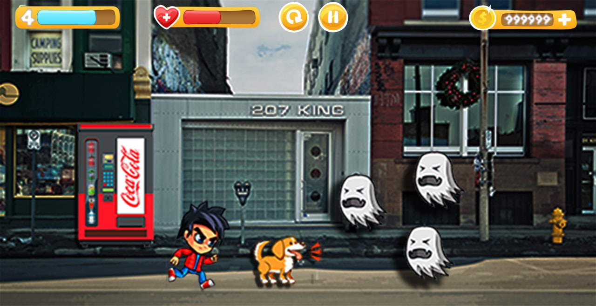

# Super Woof!

Imagem da proposta inicial:

## Sobre o Jogo

Super Woof! é um jogo que segue o clássico enredo de jornada do herói. No entanto, neste jogo, o protagonista é um garoto e seu fiel cachorro, que embarcam em uma jornada para resgatar sua namorada raptada pelo Rei Fantasma que invadiu a terra. Os jogadores explorarão uma variedade de ambientes, desde subúrbios e cidades até fazendas e prédios de multinacionais, incluindo um ambiente de escritório. Todos os cenários são ricamente americanizados, proporcionando uma experiência única e envolvente.

## Iniciativa
O desenvolvimento do Super Woof! é uma iniciativa do grupo [Os PROGRAMADORES](https://osprogramadores.com/). A ideia original foi concebida pelo [@erickofs](https://github.com/erickofs) e a iniciativa de desenvolvimento foi apoiada pelo [@mpinheir](https://github.com/mpinheir). Após toparmos a proposta, formamos uma equipe colaborativa para trazer essa emocionante aventura à vida. Atualmente a equipe é formada por: [@erickofs](https://github.com/erickofs) e [@Asunnya](https://github.com/Asunnya).

## Objetivo
O objetivo principal do *Super Woof!* vai além da diversão. Durante o andamento do projeto, buscamos ensinar aos colaboradores sobre os diversos aspectos envolvidos no desenvolvimento de jogos. Queremos proporcionar uma experiência educativa, incentivando a compreensão dos elementos por trás da criação de um jogo.

## Participação Voluntária
O desenvolvimento do Super Woof! conta com a participação voluntária de indivíduos apaixonados por jogos e dispostos a contribuir para a criação de algo único e educativo. Acreditamos que a diversidade de talentos e perspectivas enriquece o processo criativo, e damos as boas-vindas a todos que desejam se envolver nessa emocionante jornada.

## Como Contribuir
Se você estiver interessado em contribuir para este projeto, siga os passos abaixo:

Comente no projeto, abra uma issue ou até mesmo envie um Pull-Request com a sua sugestão.
